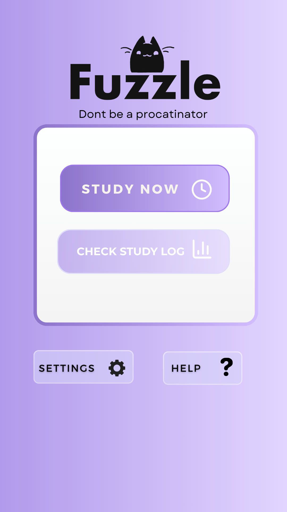
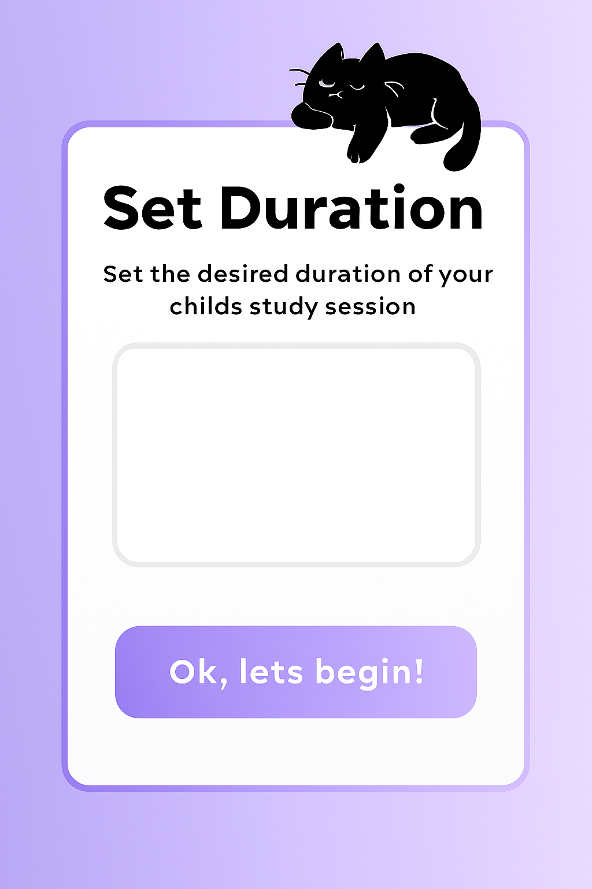
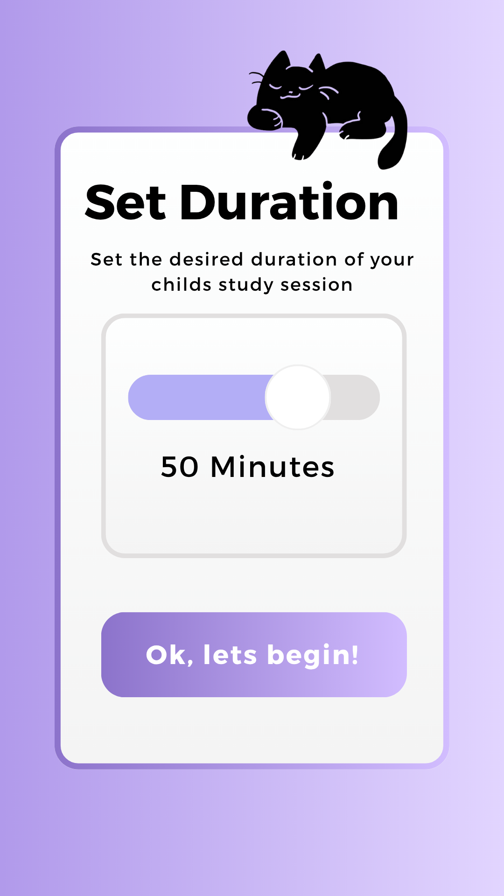

# Fuzzle

Fuzzle is a focused study app built with Flutter, featuring study sessions, logs, device pairing (Bluetooth on mobile), and desktop-friendly window management.

## Executive summary

Fuzzle helps parents support their kids’ study habits. The app pairs with a small hardware “pet cat” (Raspberry Pi) that reflects focus state (happy/sad) and relays simple engagement signals back to parents. Built in a 4‑week sprint during Patch.

## Features

- Cross‑platform: Web, Desktop, Mobile
- Clean routing with `go_router`
- State management using `provider`
- Bluetooth pairing (mobile) via `flutter_blue_plus`
- Desktop window controls with `window_manager`

## Screenshots

<div align="center">






</div>

## Run Locally

See the quick commands in `RUN_GUIDE.md`, for example:

```bash
flutter pub get
flutter run -d linux      # Linux desktop (recommended)
flutter run -d windows    # Windows desktop
flutter run -d android    # Android
```

## My role and timeframe

- Conceived product concept and UX; led the 4‑week build during Patch.
- Implemented Flutter app (routing, state, storage, desktop ergonomics).
- Linked to a Raspberry Pi via SSH for rapid iteration.
- Designed fail‑soft behavior so the app remains useful with no device connected.

## Architecture overview

- `lib/config/routes.dart`: Navigation via `go_router`.
- `lib/shared/providers/`: App‑level state with `provider`.
- `lib/shared/services/`: Platform services (`bluetooth_service.dart`, `storage_service.dart`).
- `lib/screens/`: UI screens (home, study, logs, settings, help, pairing).
- `lib/core/themes/`: Theme and visual tokens.

## Quality and operations

- Static analysis: `flutter analyze` (no lints at commit).
- Tests: `flutter test` (widget test scaffold present).
- Scripts: `run_fuzzle.sh` and `run_fuzzle.bat` for quick setup and platform runs.
- Accessibility: semantic labels on tappable areas; high‑contrast buttons.

## Status

Development of Fuzzle is currently on hold 😓. May revisit in the future if accessible to appropiate hardware tools and further refinement of idea. Fuzzle will continue to be an ideathon merchant